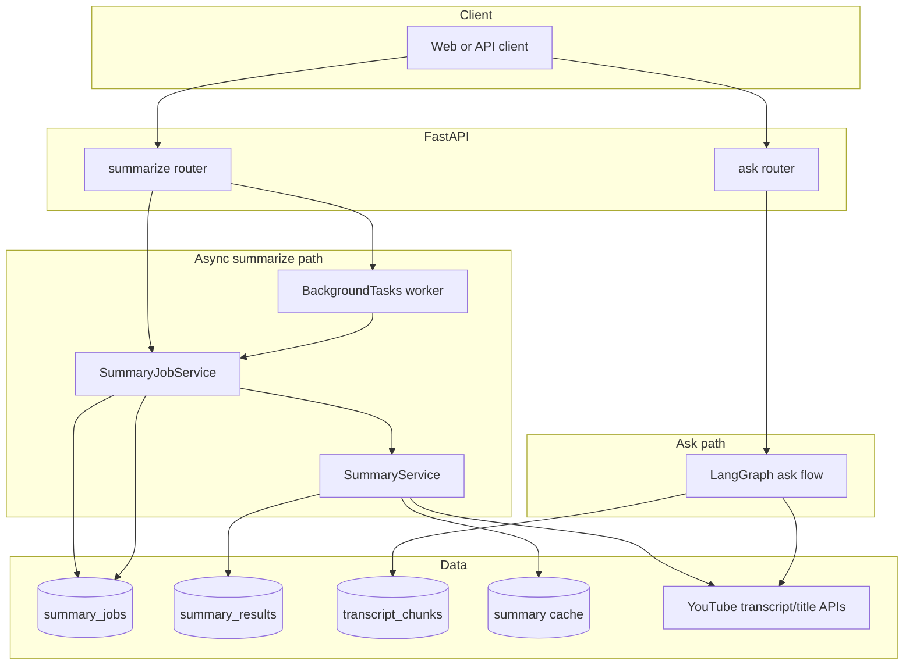
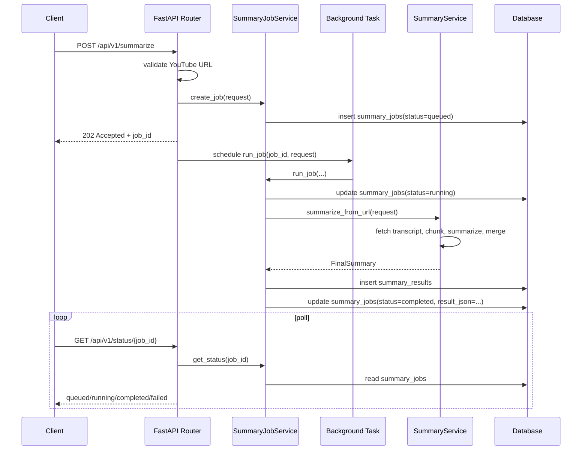

# YouTube Video Copilot - Architecture

This document reflects the current backend shape after moving summarization to an async background-job flow.

## 1. Goals

- Long YouTube videos should not hold the HTTP request open while the full summarize pipeline runs.
- The API should return a stable `job_id` immediately so clients can poll for progress.
- Job state should survive across requests and expose final results or failure details.
- The existing summarize pipeline should stay reusable for compare, export, and other synchronous internal callers.

## 2. High-level flow

1. Client calls `POST /api/v1/summarize`.
2. Router validates the YouTube URL shape and creates a `summary_jobs` row with status `queued`.
3. Router returns `202 Accepted` with `job_id` and `status_url`.
4. FastAPI `BackgroundTasks` starts the summarize worker after the response is sent.
5. Worker marks the job `running`, executes the existing `SummaryService` map-reduce pipeline, and persists the summary result.
6. Worker updates the job to `completed` with serialized `FinalSummary`, or `failed` with structured error metadata.
7. Client polls `GET /api/v1/status/{job_id}` until the job reaches a terminal state.

## 3. Components

| Layer | Responsibility |
|------|------|
| `app/routers/summarize.py` | Enqueue summarize jobs, expose status endpoint, keep HTTP contract thin. |
| `app/services/summary_job_service.py` | Own job creation, background execution, status shaping, and restart recovery. |
| `app/services/summary_service.py` | Existing transcript fetch, chunking, LLM summarization, chapters, suggested questions, and cache logic. |
| `app/repositories/summary_job_repository.py` | CRUD for `summary_jobs` lifecycle transitions. |
| `app/repositories/summary_repository.py` | Persist completed summaries to `summary_results`. |
| `app/db/models.py` | SQLAlchemy models for `summary_jobs`, `summary_results`, and transcript chunks. |

## 4. Data model

### `summary_jobs`

Persists async summarize state:

- `job_id`: external identifier returned to clients
- `trace_id`: correlates logs with the job
- `video_id`: known early when URL parsing succeeds
- `source_url`, `summary_type`, `language`: original request inputs
- `status`: `queued`, `running`, `completed`, `failed`
- `error_stage`, `error_type`, `error_detail`: terminal failure metadata
- `result_json`: serialized `FinalSummary` payload for completed jobs
- `summary_result_id`: link to the row written in `summary_results`
- `created_at`, `started_at`, `completed_at`, `updated_at`

### `summary_results`

Still stores the durable summary history used by `GET /api/v1/summaries`.

## 5. Request/response contract

### `POST /api/v1/summarize`

Returns immediately:

```json
{
  "job_id": "9ef4a95f-9db8-42bd-9c33-4b3ab48f7389",
  "status": "queued",
  "status_url": "/api/v1/status/9ef4a95f-9db8-42bd-9c33-4b3ab48f7389"
}
```

### `GET /api/v1/status/{job_id}`

Possible states:

- `queued`: accepted, worker not started yet
- `running`: background task is executing transcript and LLM work
- `completed`: `result` contains the final `FinalSummary`
- `failed`: `error` contains stage/type/detail

Example completed response:

```json
{
  "job_id": "9ef4a95f-9db8-42bd-9c33-4b3ab48f7389",
  "status": "completed",
  "source_url": "https://www.youtube.com/watch?v=abc123xyz89",
  "summary_type": "brief",
  "language": "en",
  "video_id": "abc123xyz89",
  "summary_result_id": 42,
  "created_at": "2026-04-06T02:10:15.000000Z",
  "started_at": "2026-04-06T02:10:15.120000Z",
  "completed_at": "2026-04-06T02:10:24.450000Z",
  "result": {
    "video_id": "abc123xyz89",
    "title": "Demo video",
    "summary": "...",
    "bullets": ["..."],
    "key_moments": [{"time": "00:00", "note": "..."}],
    "transcript_length": 1234,
    "chunks_processed": 3,
    "suggested_questions": ["..."],
    "chapters": []
  },
  "error": null
}
```

## 6. Summarize pipeline

The background worker keeps the original summarize business logic intact:

1. Resolve `video_id`
2. Fetch title and transcript
3. Normalize and merge transcript text
4. Chunk transcript with configured overlap and size limits
5. Check in-memory summary cache
6. Summarize each chunk with the active LLM provider
7. Merge chunk summaries
8. Generate suggested questions
9. Build key moments and chapters
10. Persist `summary_results`
11. Persist terminal `summary_jobs` state

This keeps summarize reusable outside the HTTP async wrapper.

## 7. Failure handling

- Invalid YouTube URLs are still rejected synchronously with `400`.
- Background failures are persisted on the job row instead of surfacing as request-time `4xx/5xx`.
- Persistence failure after a summary is generated marks the job `failed`.
- On startup, any stale `queued` or `running` jobs are marked failed with a recovery message so clients do not poll forever after a restart.

## 8. Operational tradeoffs

### Benefits

- Request latency is now decoupled from transcript size and LLM duration.
- Clients get explicit progress semantics with a stable polling contract.
- No extra infrastructure is required for the first async version.

### Limitations

- FastAPI `BackgroundTasks` are process-local, so this is not a durable distributed queue.
- In-flight jobs do not continue across restarts; they are marked failed during startup recovery.
- Higher throughput or multi-worker scaling will eventually need a dedicated queue/worker system.

## 9. Component diagram



## 10. Sequence diagram



## 11. Updated architecture summary

- `POST /summarize` is now an async enqueue endpoint, not a long-running request.
- `SummaryService` remains the core summarize engine.
- `SummaryJobService` is the new orchestration layer for background execution and status lookup.
- `summary_jobs` is the new persistence boundary for async state.
- `GET /status/{job_id}` is the read model for clients waiting on long videos.
